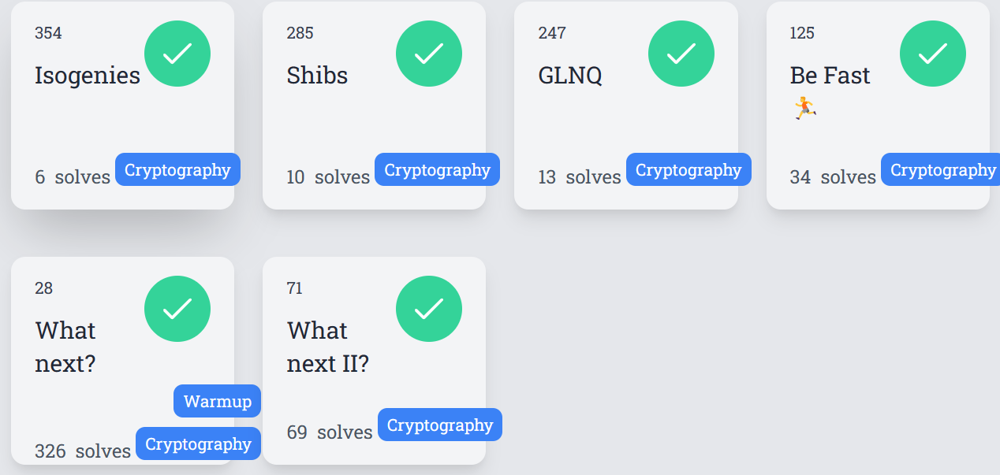
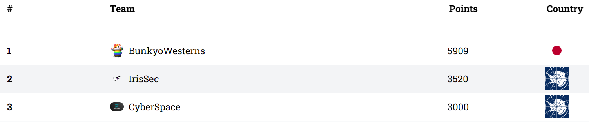
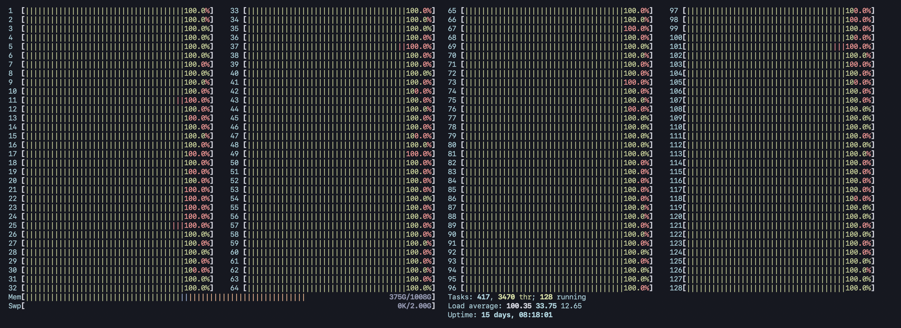
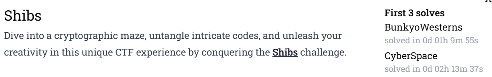
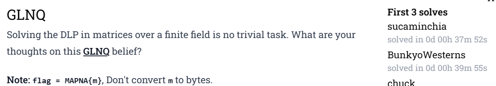
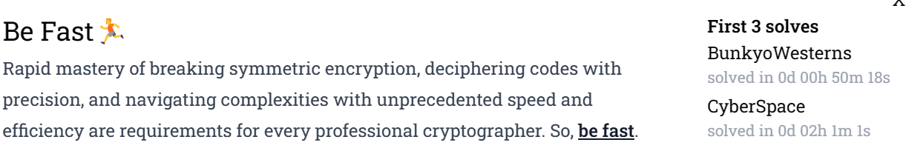
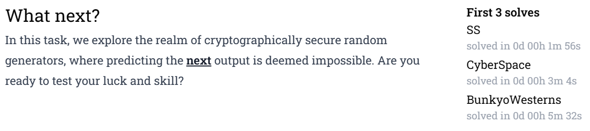
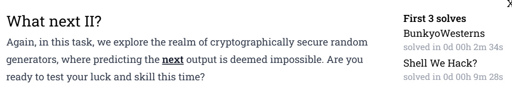

# MAPNACTF

I participated in this CTF with team BunkyoWersterns. Our team got 1st place.

I solved 5 crypto challs [Shibs, GLNQ, Be Fast, What next?, What next Ⅱ?] and I got 3 first blood, 1 second blood, 1 third blood.

I felt interesting for all crypto chall, so I appreciate for organizer to hold this CTF event thx a lot!!





## Shibs [crypto 10 solves]

### chall

```python
#!/usr/bin/env python3

from Crypto.Util.number import *
from flag import flag

def shift(s, B):
	assert s < len(B)
	return B[s:] + B[:s]

def gen_key(nbit):
	while True:
		p = getPrime(nbit)
		B = bin(p)[2:]
		for s in range(1, nbit):
			q = int(shift(s, B), 2)
			if isPrime(q):
				n = p * q
				return n, p, s

nbit = 1024
n, p, _ = gen_key(nbit)
q = n // p
dna = p & q
m = bytes_to_long(flag)
c = pow(m, 65537, n)

print(f'n = {n}')
print(f'dna = {dna}')
print(f'enc = {c}')
```

### solve

I'm so lazy this time, so I camp up with an idea which is "MAYBE WE CAN SOLVE USEING Z3"

so i created test data, concretely value of shift is 1. z3 solved this data in 5 min.

if we use single thread, take time is 85 hours. but if we can use 128 thread and high power pc, estimate is 24 minutes. OK, LETS TRY.



finally I got first blood. and the flag says  `b'MAPNA{Br4nch_&_prun3_Or_4Nother_ApprOacH???}'`. WE FOUND ANOTHER APPROACH ITS USE Z3.



```python
from z3 import *
from subprocess import check_output
from multiprocessing import Pool, cpu_count
from tqdm import  tqdm


n = 20316898932195904153277570911129808751568815578115203862825426326247688399447840960418077345063791379522152467572219078649052797300815169624324245983590614914067269781160218800744443132820786495383622657350005442865119235171347222481549171383138463856866590153226706585323109487068718209302113471433380661465050751463957327192775767168671487596946840993911799696944069759277414133632444513772210700794949276020219498655982617016744321984479076362225276288530893635176013522707993482886351558163399233902562390621254309853983712254751850630385079750216639722676398376824903099579116864460998259826947136455660974737633
dna = 112981924875557500958025001180130494828271302148393893025039250618449754880107262891213034570290994460680732065864408219699255537220809236513831561599199136870056419874815435027857448315805793914961273026882116413167515833581245087132919209478091324962372324771986076010340277554904109601589334046901209670673
enc = 3045339581292945711130813005351003100918522557110757541588006962379795819964889960982006172396478992403763951169397699477604011489683403206194674478676115307579754281253958928474112104087602753563505848223560038859380782692201785087834133116953880301903767021262497807797262966215767967235011554145888668721199447563741572273525508047234141844260401652933196055533764562153454963082569500478073362290691632890264262315099050876574517869170470080069161301450816555901477760392115210762498464643598219802952797283932722013302922244300834587051779128033516492433437534261890143822056118794447406885925957834712258842422
nbit = 1024

dna_ = bin(dna)[2:].zfill(nbit)

p = BitVec("p",nbit)
q = BitVec("q",nbit)


def solver(i):
    s = Solver()
    s.add(q == RotateLeft(p, i))
    s.add(n == p*q)
    s.add(p&q == dna_)

    print(i, s.check())
    if s.check() == sat:
        print(s.model())
        
        
_i = [i for i in range(1,nbit)]
with Pool(cpu_count()) as pool:
    for results in tqdm(pool.imap_unordered(solver, _i), total=len(_i)):
        pass
    
q = 118627270647424424141514783307481285886258073029116821903046590278901771054287488093459396876753105609837026655906589077937738668295841155401318912730133481985678923364535216697903225159999957216575823849034786092435988869550296395479754426578068176634670446795305597283053006032071267819138579464710410086097
p = 171266681103878322117424575175361468379674209043813157946561665043786388947203228350875263109216690282197981858022233522587435146007011089350418152369819924630928608372164838867715907687708478655112024432448453837808032774893387899232268630799449237496392996637407630619155994281854191089804529710230573475089
phi = (q-1)*(p-1)
e = 0x10001
d = pow(e,-1,phi)
from Crypto.Util.number import *
print(long_to_bytes(pow(enc,d,n)))
exit()
b'MAPNA{Br4nch_&_prun3_Or_4Nother_ApprOacH???}'
```


## GLNQ [crypto 13 solve]

### chall

```python
#!/usr/bin/env sage

from Crypto.Util.number import *
from flag import flag

F, k = GF(2**8), 14

while True:
	G = random_matrix(F, k)
	if G.is_invertible():
		break

flag = flag.lstrip(b'MAPNA{').rstrip(b'}')
m = bytes_to_long(flag)
H = G ** m

print(f'G = {G}')
print(f'H = {H}')
```

### solve

this matrix has b-smooth order. 

so, we can calc discrete log for pohlig-hellman algorithm.

finally I got second blood.



```python
from Crypto.Util.number import *
F, k = GF(2**8), 14
z8 = F.gens()[0]
G = ---[sinpped]---
H = ---[sinpped]---
G = Matrix(F,G)
H = Matrix(F,H)

r = 79229371458530696292133175295

def babystep_giantstep(g, y, p):
    m = int((p-1)**0.5 + 0.5)
    table = {}
    gr = 1
    for r in range(m):
        table[str(gr)] = r
        gr = gr * g
    gm = g^(-m)
    ygqm = y            
    for q in range(m):
        if str(ygqm) in table:
            return q * m + table[str(ygqm)]
        ygqm = ygqm * gm
    return None

def Pohlig_Hellman_DLP(P,sP,order):
    primes = []
    for i,k in factor(order):
        primes.append(i^k)
    dlogs = []
    for fac in primes:
        t = int(order) // int(fac)
        dlog = babystep_giantstep(P^t, sP^t, fac)
        assert  (P^t)^dlog == sP^t
        dlogs += [dlog]
        print("factor: "+str(fac)+", Discrete Log: "+str(dlog))
    return crt(dlogs, primes )


flag = int(Pohlig_Hellman_DLP(G,H,r))
assert G^flag == H
print(flag)
# MAPNA{6424379811053277573417442136}
```

## Be Fast🏃 [crypto 34 solve]

### chall

```python
#!/usr/bin/env python3

from random import *
from binascii import *
from Crypto.Cipher import DES
from signal import *
import sys, os
from flag import flag

def die(*args):
	pr(*args)
	quit()

def pr(*args):
	s = " ".join(map(str, args))
	sys.stdout.write(s + "\n")
	sys.stdout.flush()

def sc():
	return sys.stdin.buffer.readline()

def shift(msg, l):
	assert l < len(msg)
	return msg[l:] + msg[:l]

def pad(text):
	if len(text) % 8 != 0:
		text += (b'\xff' * (8 - len(text) % 8))
	return text

def encrypt(msg, key):
	msg = pad(msg)
	assert len(msg) % 8 == 0
	assert len(key) == 8
	des = DES.new(key, DES.MODE_ECB)
	enc = des.encrypt(msg)
	return enc

def main():
	border = "+"
	pr(border*72)
	pr(border, ".::        Hi all, you should be fast, I mean super fact!!       ::.", border)
	pr(border, "You should send twenty 8-byte keys to encrypt the secret message and", border)
	pr(border, "just decrypt the ciphertext to get the flag, Are you ready to start?", border)
	pr(border*72)

	secret_msg = b'TOP_SECRET:' + os.urandom(40)
	
	cnt, STEP, KEYS = 0, 14, []
	md = 1

	while True:
		pr(border, "please send your key as hex: ")
		# alarm(md + 1)
		ans = sc().decode().strip()
		# alarm(0)
		try:
			key = unhexlify(ans)
			if len(key) == 8 and key not in KEYS:
				KEYS += [key]
				cnt += 1
			else:
				die(border, 'Kidding me!? Bye!!')
		except:
			die(border, 'Your key is not valid! Bye!!')
		if len(KEYS) == STEP:
			HKEY = KEYS[:7]
			shuffle(HKEY)
			NKEY = KEYS[-7:]
			shuffle(NKEY)
			for h in HKEY: NKEY = [key, shift(key, 1)] + NKEY
			enc = encrypt(secret_msg, NKEY[0])
			for key in NKEY[1:]:
				enc = encrypt(enc, key)
			pr(border, f'enc = {hexlify(enc)}')
			pr(border, f'Can you guess the secret message? ')
			alarm(md + 1)
			msg = sc().strip()
			alarm(0)
			if msg == hexlify(secret_msg):
				die(border, f'Congrats, you deserve the flag: {flag}')
			else:
				die(border, f'Sorry, your input is incorrect! Bye!!')

if __name__ == '__main__':
	main()
```

### solve

we can send 8keys, and server makes  kyes = [key, shift(key, i) for i in range(7)] + NKEY.

so I send keys = [long_to_bytes(i)*8 for i in range(8)],  kyes = [key, key for i in range(7)] + shuffle(kyes[-7:]).

we can calc all because key patterns are 7!

I got first blood!!



```python
from pwn import *
from Crypto.Util.number import *
from Crypto.Cipher import DES
from itertools import permutations

def pad(text):
	if len(text) % 8 != 0:
		text += (b'\xff' * (8 - len(text) % 8))
	return text

def encrypt(msg, key):
	msg = pad(msg)
	des = DES.new(key, DES.MODE_ECB)
	enc = des.encrypt(msg)
	return enc
def decrypt(msg, key):
	des = DES.new(key, DES.MODE_ECB)
	enc = des.decrypt(msg)
	return enc

_key = []
keys_all = []
for i in range(7):
    _key.append(long_to_bytes(i)*8)

secret_msg = b'TOP_SECR'

cands = []

for i in permutations(_key):
    msg = secret_msg
    keys = []
    for _ in range(14):
        msg = encrypt(msg, b"\x00"*8)
        keys.append(b"\x00"*8)
        
    print(i)
    for _i in i:
        msg = encrypt(msg, _i)
        keys.append(_i)
    cands.append(msg.hex())
    keys_all.append(keys)

key = ""
for i in range(13,-1,-1):
    key += (long_to_bytes(i)*8).hex()+"\n"
io = remote("3.75.180.117",37773)

io.send(key)
io.recvuntil(b"enc = ")
a = io.recvline().decode()
enc = eval(a)
enc = bytes.fromhex(enc.decode())
for i in keys_all[cands.index(enc[:8].hex())][::-1]:
    enc = decrypt(enc,i)
io.sendline(enc[:-5].hex().encode())
io.interactive()
# MAPNA{DES_h4s_A_f3W_5pec1f!c_kEys_7eRm3d_we4K_k3Ys_And_Sem1-wE4k_KeY5!}
```

## What next? [crypto 326 solve]

### chall

```python
#!/usr/bin/env python3

from random import *
from Crypto.Util.number import *
from flag import flag

def encrypt(msg, KEY):
	m = bytes_to_long(msg)
	c = KEY ^ m
	return c

n = 80
TMP = [getrandbits(256) * _ ** 2 for _ in range(n)]
KEY = sum([getrandbits(256 >> _) for _ in range(8)]) 

enc = encrypt(flag, KEY)

print(f'TMP = {TMP}')
print(f'KEY = {KEY}')
print(f'enc = {enc}')
```

### solve

First, I don't know provide KEY, so I thought that we need to recover MT's state lol.

I got third blood. 



```python
import random
from extend_mt19937_predictor import ExtendMT19937Predictor
from random import *
from Crypto.Util.number import *

predictor = ExtendMT19937Predictor()

TMP = [0, 60532113298156934035006892408508955361282411773999112364347341111075018147927, 389708033651020865401865717693397865196213972164600460902422823183461779915980, 405918065202512971659130608346843374237984902589139232574420604120059844720341, 1221288278415504784467034784431436409217396366988324269872668238978249045586368, 227272449199630828507165833400505281743840056074337728659380026370174597983400, 3253503829229933909142928710502222745989372185283055446591180092486412602783216, 5285988746830110954075248573612981420829816533804399404046882938020472042330356, 1595336926944568705525401229738700126737605961193041889427425025694023495226176, 7954983836536199412561303342870946300319308569704526681942922892057412417369996, 9131160911707622814886835054526857850430982962993746463098999466544684215014000, 7533615981375704965377803926757920571133747559444638616597692539324665788824241, 9066823514420452679519089047747738557989264923523328666138044339979172532091952, 11067455968068371535244972547693443476921719558645991175617294899803940399861323, 14537042287558789972327728985738890609505033466725608088977070967810362118279248, 4572250646126446008858673089127752592787335839144590539404665629413086318239650, 6294362797378922374391238457327978545276595686984712745478781562202157935775488, 22747367842710135893711619452307079245750111941624369856170309106764880998100552, 6004893915710283480070189414407284168050988366555745204074130859740178577433240, 14420752900418475271133573248938786225809597358248108049760284685159047602036537, 43733009974069364671572839996339051940609184658654624940598489171524524051944400, 35346194693613025068395009821809884943769752588359988505793537720962714260019869, 42204169462513802238599356946318680734527685184414356760365290489529820960713072, 34277378263896547381266820799512178423239236243790865361707633583497481357796407, 65716310119362366398237218525711748744052085839683547702975404773566674635748352, 46557817276176359993118228055060795747091243514590105677103910660112788974583750, 77490786359937960192983922284789298329689351038928181926278354279011358030727124, 80111990003818834469282875276984278230143118837645016537448310618261479083651342, 20554557048628019672240583641369145446540900712224309311213526066135949044952288, 62735818615066536453205944582471026825278180907531123883210362947117955616343781, 86042719783890082289653687251665836736491344225760521302063306208331002685576500, 25965698487671814117818570753889366721907386924362900403011501627358460499758383, 29616377817002001833630895361629451907964508596441826676791174072122929285049344, 15021399892362753107059884462124333866295538287397369553705410328403621774185468, 38002604304046319679742306015002655608233191413179528560874731009946042988120788, 93295366307461634335632781504982997626366942447637302439067556300965151557831725, 13540230203788528048897000123546822994874145971630139618336417120723676174022384, 154432198666672358575141914680506005090971687803151597762263520020713308780579072, 72136447292935153078321891268785033320056922245403740454889157780753773717242568, 25501852421215926138677841658578129717118066368151623403551273037829983575243468, 126735578787059666358271681647457626985119387894943043206239792071598867033556800, 135202944925842633454294137881609034393280829104975826296437659832444402212706990, 195878634803984461306574869979621981219794907747012161075921193902109987239350696, 70016262426074427215170249788098050659024805306136436354383469618536112786361350, 35956258331474238072248600117735641962702369830606009799455005594969570110652976, 22225110718496125427125444008161845696087660990666988086936919846739655848747525, 27548874118316168690466237353230253832267098824834641381166573208182433313572936, 217350749041695488338708373584952864553819378993764330831653495907756867001916100, 257655749972831097290040240403045642767794308639832322802465135822003512301701120, 170931799252374463455850569878339599585582089254513276315581340035784063404547904, 260648666226967018693658250893274370482164362954223893135614467834502818278817500, 69425639907308137984060966310312800675576800616943121851698019398372874074587564, 38272797691322675978111710027833013466477209475584360707344650868692232767605712, 159989233909295381868776328891896676159494718709642790902586750185703386017519100, 239424076217975267533547688379482794244638593887104216992730670874367591889686424, 235805166260230600224517436738096467578276265139558424271706458619605152151155650, 312887850933221623827051251636459958804378796969233372438708909260471396708839360, 226254410804533566347737443581029620895018482953889083109343308899334155214465084, 75663356945666060728297569858199894519238029780108571803169998187745851675033696, 379521198853533961681034095706543224338730654829393858931702778389925326037905581, 146969137746310211928872994682693200202368153046275429574482720738790962130698000, 294260825765970965744028560390675570627618373545459966200549616640279283196332026, 319516693693602451939925738770832547195167488538421484010981799971938667101170272, 235996689233669489969452603688581556879686306558426802897567227857894956933720385, 129860515531400644974201481565448922647210002409167735625695108262182647544782848, 434775250558913676954052533315009488640533958618010407554959841056206485055286800, 22149580084411886515787074680813749427656731151235741580693077660337965563693340, 250909616829332329061530688103059354065323867429954924090541815760594873142372389, 190341994069073757182537956898692121864681766192223013320579410693514741018663328, 498585070302128781878557564834342148816012866139626477296471773760922822044892275, 263835635996152386059834449296099627577713122650362830498873071118489986876211700, 225673582284037816919955555063840997388361787112308169031986640074367056949780747, 361331112554037421979550439774599874333938415297694314983681794489970792139813248, 254546085100670719262378937737022676839283545191763458089424319101240909887973785, 253610597769560898884657084492335380622121458721155827380866680741694312733007816, 457274233985553849774588573500169926255994068617887370590713102886816853234873125, 449778455880514807591245873496025212715825137347886177910517238904962733456694256, 401484248501670039446475341305100595322092268787582033086127175618422362454931911, 22016053572627515851711195096973390151818785168234961407013202935121714403513020, 199223592692197859565380631569896354958045929491349287395617253114895842147327801]
KEY = 23226475334448992634882677537728533150528705952262010830460862502359965393545
enc = 2290064970177041546889165766737348623235283630135906565145883208626788551598431732

TMP = [ t//((i+1)**2) for i, t in enumerate(TMP[1:])]
print(TMP)
for T in TMP:
    predictor.setrandbits(T, 256)
    
    
KEY = sum([predictor.predict_getrandbits(256 >> _) for _ in range(8)]) 

def encrypt(msg, KEY):
	m = msg
	c = KEY ^ m
	return c

print(long_to_bytes(encrypt(enc,KEY)))
b'MAPNA{R_U_MT19937_PRNG_Predictor?}'
```

## What next II? [crypto 69 solve]

### chall

```python
#!/usr/bin/env python3

from random import *
from Crypto.Util.number import *
from flag import flag

def encrypt(msg, KEY):
	m = bytes_to_long(msg)
	c = KEY ^ m
	return c

n = 80
TMP = [getrandbits(256) * _ ** 2 for _ in range(n)]
KEY = sum([getrandbits(256 >> _) ** 2 for _ in range(8)]) 

enc = encrypt(flag, KEY)

print(f'TMP = {TMP}')
print(f'enc = {enc}')
```

### solve

ok, version 2 don't provide a Key, but unluckily I solved this type in previous chall.

so, i copied my sol lol.

I got first blood in 2 minutes lmfao.



```python    
import random
from extend_mt19937_predictor import ExtendMT19937Predictor
from random import *
from Crypto.Util.number import *

predictor = ExtendMT19937Predictor()

TMP = [0, 22330693840234311255135949029444484409546667648719176405826663892267656641027, 127168478027482847709328807841325386271927515479937061237117195618823278578116, 182258311374053859620888699680212168010665323374548870180038645090147843867373, 1120044041165490856498692287111236626472260308631093314161690677868431277653536, 1983473421395194676263973602935227753154638099492341714205203280778040675593450, 1574768551732085861078069762534699936995654652684634077104498873387111232412816, 4988773041677976257517254491234335651753610239922582254283447205154548743632904, 869738033317159039287197189670964123964466628318970710545560734535418094431872, 716771557072892076589368879721160406613516964478389692662921907034616035095047, 2841054733362182186252458286741823726277405165099408732758691872324732479956600, 6200268989316199565071790593244237980113705529543497656127585449937778556282311, 10670728743047162087774896911955052588177734200772863764402582886370432879158720, 7713906922622752752151916696524419287963819641354815269293605765422900017233866, 13689077681405838115291939958594572280593102467042881661528817316126253635857444, 23677404931618939684375357302211056316481456538100460743428412550112769975941300, 22334702277647520331031971258896634990832479997228972554803329027443498276011264, 24695994670269108821474844143270568317378271123560130717104045624895774803117988, 10726839246587772223823222881528936091917884797218227418638385365176143122217812, 1312747277711228023681888222399668996816715931126782050057534166588569071642948, 14829434912751138825019062212374862054511849430113519894438429231649766515851600, 4917180643387964007287001238070594020985844865025196727991425387470641537875518, 50772176246766546694026388399540445347088279634906123947563600159509306535585300, 20680598744337311676861190641592800456437920078216405214477640693225317242487078, 57560623230262776939750106414721715686651269149245752162663251361023294801081600, 63941301709699592129851769466238327968731332723117779339939586823464299930335000, 30248094445348087425063737332624900285689080519537666953907462011122884602991780, 9774708715683840095021685805936771586028623975773332766526807054152590972465402, 61228751294246951869891671407294469506401133460669313068369993608651062307301536, 41981261972157910420555352577742115252749734931422260886610665615142932761250238, 92332289648534120255700799585162857690611895814212622902006472593032842219422300, 102090694836612045964656351247645673041342905792690679450732518780700786595757872, 8465306744686231379969736050689382339949995071265316552433666241539252681451520, 114072153081233359084524715014825650254537286682603109151986752844288607088786066, 39946361462751138749261511325777846481011288953117931061771127396007551287911208, 51243479474799144289518571031495536096625532453885999576052634625243425716758700, 132356504405092579871543186323238530972479261975470487510352508943760068475015440, 109077835346013498228568867183016137777644328620298812835459712256002833220195417, 52635267919343130972014005273289555808336337947193348140410148289978267235415648, 9568343438735227407132147420705807168258684366618511035784505242511446472528193, 136103745592722122037143341370556407561964415802887285393102934361453911394982400, 15501324115571167305412632833471884183641743683875758176471163573103721210677697, 124579054262159655532164017523017564697199759561416452868759873217906475930663652, 69331433672201876294056448428159828327113921951663941374636039203754564050923557, 134825790087045765574290263555594553874136924161813224135475519279020442040026864, 127098236196925756090074171499128508507461799729629969599917408442298996799214250, 120716315173788627251671396349879537684221828425501013413665864262612928100844788, 246230945837378885729579613348413794121875158206606559652651668292953179058653508, 182436930868427241575608788617950343128628563937798409868187047670441481734494464, 2216307326510769061988701188806623458793041637834505792592287312459658319545700, 217778196427604121810125555838576095983026719310491477185297193068203986197977500, 200042153662024093707446037685450040433674498805614787040971237961725493946807124, 55096521527758008435839474651130444687406648424301616531387151625485823586357376, 315911207494925949742212443025101639383551363855632617410391325922132118052280432, 160608721274889447938606989650810386105243008009388938737103600719751998405695052, 80485718020426913778898398898436382386718914865993732581279132006386834763843750, 175256027423949464821148437330609889703365513530429385704635213979205690543187968, 312494592697141143680238564093947039458907138790072672218576868913190841311490441, 12551558878313236197845748627693664902436846005140074555532691630477757920400492, 368163678666609325358026149200535116090648801749210267074911311082497122727619418, 132244486142872991925346591101049195464960273281071718729683433268064480383763200, 187524820546739515326467479985404725103464284941528452333038247179114024353648176, 283320427018968981710753682470612392210145925235229015984823155988278867852342424, 273076274412276025537791810337835157311632197268182698230310819989050497776963263, 327014096802403962955714851262399814244813548393488285833127238998882721132883968, 206832690482752439833856322955815020186765387390104398292271480795930880106073325, 104167288428075991079921385804154376915444422785935287020330329091692992364020356, 468442878028756757484855000070722747267796721762231179211069666438706434848755245, 13006681553773847728990900149289800641720551387610802780788594468812438984199760, 199716185379958028413200192962692404940513822154864483463050473557869065589649168, 412558417168152436059170177108518481504104909389966119467224740980715361039084900, 379013360598848524426838307544021120793535763669172279637583374247930017257612752, 79510803625960975136293110699095743477640774841480691165531320726532279504009152, 119246467719878286004186703543298639812649580965124121805161153548472942538790653, 44235048729597559877492812430806736314711896199059487848598597142896457753232432, 453319033816285234767354843915966019736243075972507643199351036007057824008570000, 300975897791737470999557383409844137620736489995632513055593286593028252152372832, 488688724028459389993054497130088474659149461722402520817247390457263798063265080, 98311703485802819685121101139900586756957739352203591545958914778011243453808576, 503894794312461918204750180188338003935699664049776370432270755067603639622480931]
enc = 1954128229670403595826293823451515985816812578139791173172421160740653397416251058891670696398940725266238000104900728729829302299509397650740333416176077

TMP = [ t//((i+1)**2) for i, t in enumerate(TMP[1:])]
print(TMP)
for T in TMP:
    predictor.setrandbits(T, 256)
    
    
KEY = sum([predictor.predict_getrandbits(256 >> _)** 2 for _ in range(8)]) 

def encrypt(msg, KEY):
	m = msg
	c = KEY ^ m
	return c

print(long_to_bytes(encrypt(enc,KEY)))
b'MAPNA{4Re_y0U_MT19937_PRNG_pr3d!cT0r_R3ven9E_4057950503c1e3992}'
```


