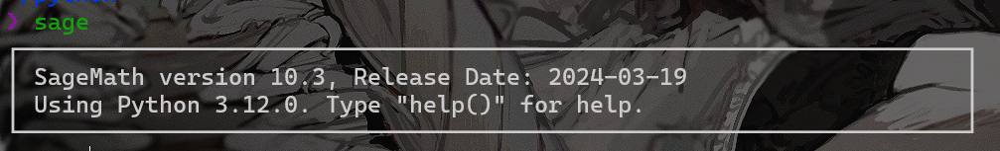

# Sagemath

> SageMathは数学の幅広い処理を扱うソフトウェアである。扱う処理は計算機代数、組み合わせ、数値計算など多岐に及ぶ。工学的応用に加え基礎科学の研究も対応している。

よくCTFでつかうやつ

## 状況

2024年3月22日現在、Sagemathの最新版は10.3, pythonはpython3.12.2が安定バージョンでの最新みたいです。しかし、Ubuntuでは`sudo apt install sagemath`でインストールすると`9.5`がインストールされるはずです。これはちょっとバージョンが古いので最新のSagemath10.3×python3.12.2で環境作っていきます。(私はpython3.12.0でやってしまったんですが、まぁ大丈夫かと...)

## 構築

必要なライブラリ一式をinstallしていきます。注意として、python3をinstallする前に行ってください(一部のライブラリがsagemathのビルドで必須となりもう一度インストールする羽目になるので...)

```bash
sudo apt update
sudo apt install bc binutils bzip2 ca-certificates cliquer cmake curl ecl eclib-tools fflas-ffpack flintqs g++ gengetopt gfan gfortran git glpk-utils gmp-ecm lcalc libatomic-ops-dev libboost-dev libbraiding-dev libbrial-dev libbrial-groebner-dev libbz2-dev libcdd-dev libcdd-tools libcliquer-dev libcurl4-openssl-dev libec-dev libecm-dev libffi-dev libflint-arb-dev libflint-dev libfreetype6-dev libgc-dev libgd-dev libgf2x-dev libgiac-dev libgivaro-dev libglpk-dev libgmp-dev libgsl-dev libhomfly-dev libiml-dev liblfunction-dev liblrcalc-dev liblzma-dev libm4rie-dev libmpc-dev libmpfi-dev libmpfr-dev libncurses5-dev libntl-dev libopenblas-dev libpari-dev libpcre3-dev libplanarity-dev libppl-dev libprimesieve-dev libpython3-dev libqhull-dev libreadline-dev librw-dev libsingular4-dev libsqlite3-dev libssl-dev libsuitesparse-dev libsymmetrica2-dev libz-dev libzmq3-dev libzn-poly-dev m4 make nauty openssl palp pari-doc pari-elldata pari-galdata pari-galpol pari-gp2c pari-seadata patch perl pkg-config planarity ppl-dev python3-distutils python3-venv r-base-dev r-cran-lattice singular sqlite3 sympow tachyon tar tox xcas xz-utils tcl-dev tk-dev
```

次に、python3.12のインストールしていきます。

`Python-3.12.XXX.tgz`の`XXX`はインストールするものに名前を変えてください

```bash
mkdir ./python && cd ./python
wget https://www.python.org/ftp/python/3.12.0/Python-3.12.XXX.tgz
tar -xvf Python-3.12.XXX.tgz
cd Python-3.12.XXX
./configure --enable-optimizations
sudo make install
```

これでpythonのインストールは終わりsagemathのインストールを行っていきます。

```bash
sudo apt install autoconf automake libtool pkg-config
wget https://ftp.riken.jp/sagemath/src/sage-10.3.tar.gz
tar xf sage-10.3.tar.gz
cd sage
git checkout develop
./configure --with-python=python3.12
MAKE="make -j8" make
sudo ln -sf $(pwd)/sage /usr/local/bin
```

これでSagemath10.3のインストールが終わります。

最後にsageのコマンドを確認すれば問題なく起動していることがわかるはずです。


