# Jenga

この問題はAESをベースにした問題で変更点は2点あります。

* ShiftRowsが`hori`という関数に、MixColumnsが`vert`という関数に対応しています。（内容の差異は後で）
* 更に奇数ラウンドではhoriのみ使われ、逆に偶数ラウンドではvertが使われます。

# AESの攻撃って

基本的にいろいろありますが、代表的なものとして、線形解読法(linear cryptanalysis)や差分解読法(different cryptanalysis)、SboxをAffineとしてlinearととらえるものがありますよね。

この問題では、AESで解析でよく用いられているsquare attackというものを用いて攻撃を行います。

注意としてこの問題では3×3の行列やアルゴリズムが異なるものを扱っている都合、AESとは一部攻撃方法が異なる部分があります。

# 各関数について

## hori

AESで言うとShiftRowsにあたる部分で、数式では$HORI$として、逆関数を$HORI\_INV$としておきます。

horiは水平に3回行いますが簡略化のため1行のみ記載しています。

$$HORI(x) = (4\*x_0+2\*x_1+x_2,x_0+4\*x_1+2\*x_2,2\*x_0+x_1+4\*x_2)$$​

さらに、$$HORI(x\oplus y) = (4\*(x_0\oplus y_0)+2\*(x_1\oplus y_1)+(x_2\oplus y_2),(x_0\oplus y_0)+4\*(x_1\oplus y_1)+2\*(x_2\oplus y_2),2\*(x_0\oplus y_0)+(x_1\oplus y_1)+4\*(x_2\oplus y_2) =\\((4\*x_0+2\*x_1+x_2)\oplus (4\*y_0+2\*y_1+y_2),(x_0+4\*x_1+2\*x_2) \oplus (y_0+4\*y_1+2\*y_2),(2\*x_0+x_1+4\*x_2)\oplus(2\*y_0+y_1+4\*y_2))=\\HORI(x)\oplus HORI(y)$$

という分配則も成り立ちます。

## vert

AESで言うとMixColumnsにあたる部分で、数式では$VERT$とし、逆関数を$VERT\_INV$としておきます。

今回の関数において、vertは垂直に3回行いますが計算内容はhoriと同じため省略します。また分配則も成立します。

## xor

AESで言うとAddRoundKeyにあたる部分で、数式では$i$ roundのxorを$XOR_i$とし、逆関数を$XOR_i\_INV$としておきます。

## sbox

AESで言うとSubBytesにあたる部分で、数式では$sbox$、逆関数を$sbox\_INV$とします。

# Square attack

1byteだけ変えた入力を繰り返し行い出力の関係性を見ることで鍵を求めてみようというものです。

## round 1

1roundだけ見ていきます。入力として、緑の部分だけ変えて、後は固定の値を与えるとします。

具体的には`[bytes([i])+b"\x00"*8 for i in range(256)]`みたいな感じです。

結果として、下の図のように変化させた部分が緑の部分へ影響を及ぼしていることがわかります。ただ、このうち6つ分の値は影響を受けないため固定なため白にしています。

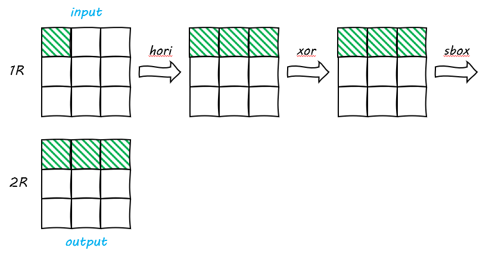

ここでわかっている部分や計算可能な部分を青で塗りつぶします。

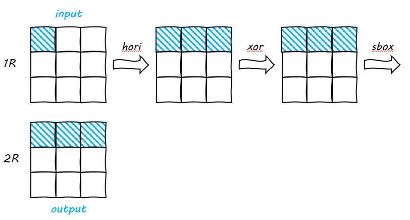

`hori`と`sbox`は逆関数が存在することで結果的には全ての状態の値がわかります。ということはxorの値もわかるので1roundは簡単に鍵が求まるということになります。

式で表せばこんな感じになります。

$$SBOX(XOR_1(HORI(input)))=output \Leftrightarrow XOR_1(HORI(input)) = SBOX\\_INV(output)$$

## Round 2

次に2roundを見ていきます。入力は1 roundと同様に緑の部分だけ変えて、後は固定の値を与えた結果、以下のようなものを得られます。

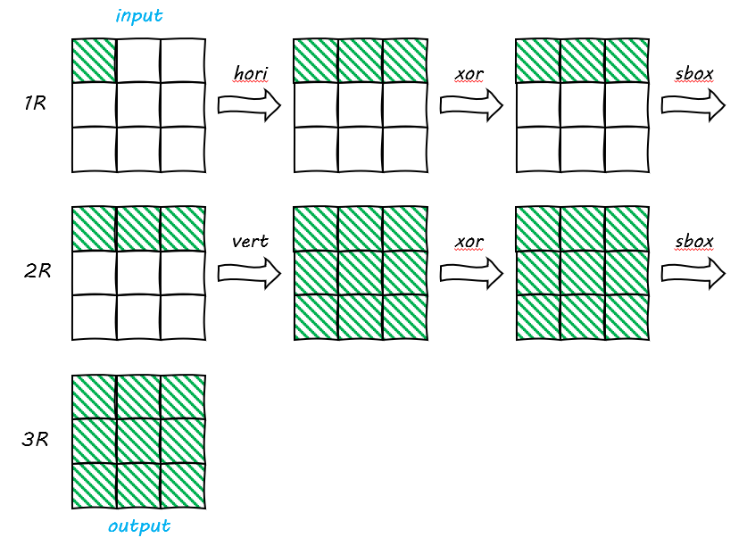

同様にわかっている部分を青で埋めていきます。

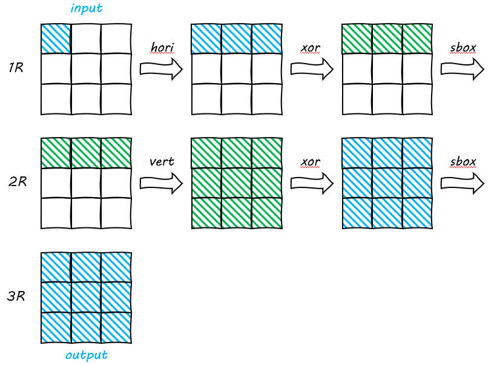

というわけで、1roundと比較してすべての状態がわかるわけではないとことになっています。

ただ、仮に1round目のsboxのカギを決め打ちで決定できるて、更に白の部分の値も具体的にわかると仮定した場合、2round目のsbox直前の全ての値がわかるので、vertもすべての値を計算することができます。

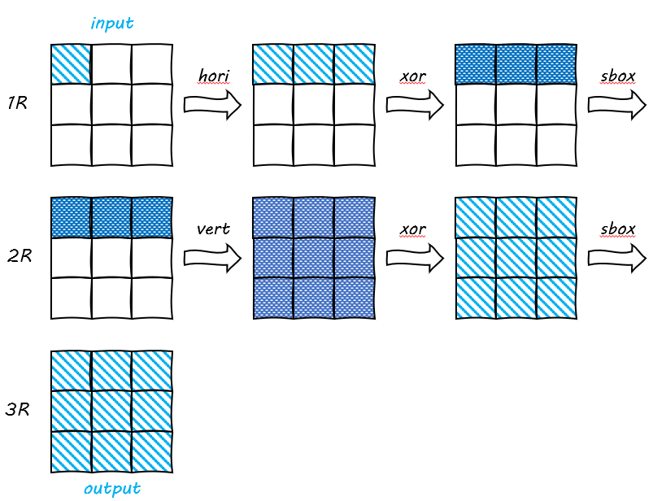

結果的に、1roundと同じよう計算していけば2Rのカギもわかりそうですね。

ただ問題は仮定の部分で、

* 1round目の鍵空間は$2^{8×3}$​あるので、ちょっと計算が重いかも
* 白の部分の値の固定をどうするのか...

一番の問題は`白の部分の値の固定をどうするのか`という部分

こんな時は2つの入力を使って解決します。便宜上、入力を$input_1,input_2$​とします。

この時すべての状態で$input_1,input_2$​のXORを取ります。

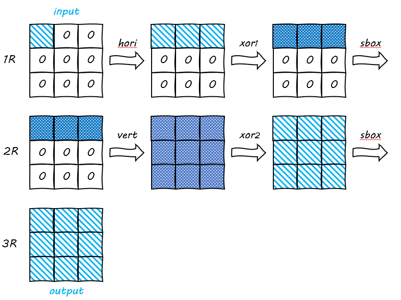

すると、白部分が`\x00`になることがわかります。何がうれしいのかというと、sbox後も0になることです。これで、vert部分が計算できるということになります。

## Round 3

影響が2回被る部分を赤で示しています。ここまでくるとちょっときついですね...

少し、工夫をすると1round削減できます。

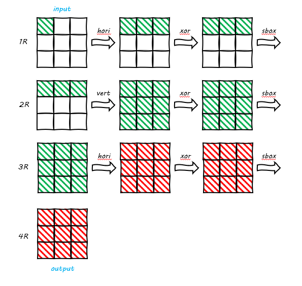

具体的には今まで入力として与えていたものは`input=\x01+\x00*8`みたいなものでした。これに$HORI(input)^{-1}$としたものを与えると1round目のhoriにて1つの値にのみ影響を与えることができます。これにより1round目のsbox直後の値が1つのみにとどまるので2Roundと同じ攻撃が起こなうことができます。

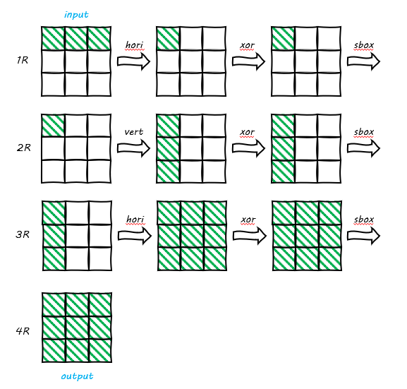

## Round 4

今回はRound 3で行ったテクニックは用いず考察していきます。Round2では白の部分を1つの入力用いて固定していました。これを拡張する方向性で考えていきます。具体的には2Rのsbox直後まではinputの緑によって制御されるということ。それ以降は緑が重複するため制御は厳しそうです。なので、これらをうまく制御して計算途中はわからないが計算結果をわかればよいという方向性で2Rのsbox直後まで求めていきます。

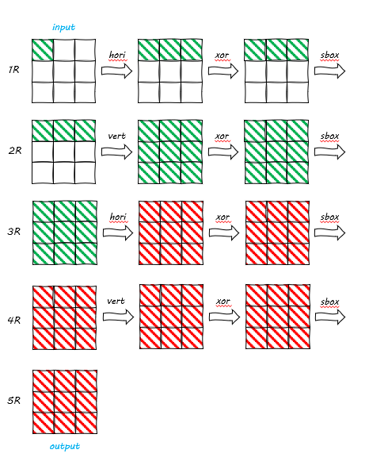

具体的には以下の式を考えます。
$$\oplus_{0\leq i \leq 255} SBOX(XOR_2(VERT(SBOX(XOR_1(HORI(input_i))))))$$

とはいっても長いので1つずつ見ていきます。

1. 1Rのinputの時の緑(左上のみ)

   $\oplus_{0\leq i \leq 255} input_i = 0$になります

2. 1Rのhori直後の緑(上段のみで左からインデックスを$0\leq j \leq 2$​とします)
   分配則と1.より$\oplus_{0\leq i \leq 255} HORI(input) = 0$​​になります。

3. 2.と1RのKEYを偶数回XORすることになるので$\oplus_{0\leq i \leq 255} XOR_1(input) = 0$になります。

4. 3.において緑の場所に出現している値は256個あるため、$\oplus_{0\leq i \leq 255} SBOX(input) = 0$になります。

同様の議論を省略しますが、3Rのxor直後まで行うことができ、またそれまですべての入力に対してxorを取った値は0になる部分を青で示します。

逆に、output側から逆算できる部分を水色で示すと、以下になります。

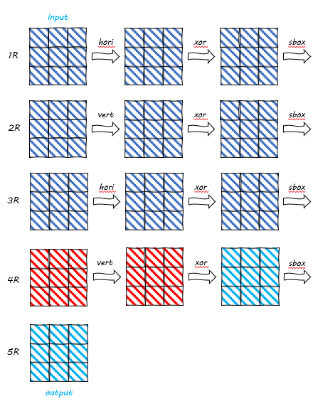

式として以下の形になります。

$$\oplus_{0\leq i \leq 255} SBOX\\_INV(VERT\\_INV(XOR_4\\_INV(SBOX\\_INV(output_i)))) = 0$$

一度、$SBOX\\_INV(VERT\\_INV(XOR_4\\_INV(SBOX\\_INV(output_i))))$に関して考えてみます。

$SBOX\\_INV(output_i))$は確実に値がわかるので$SBOX\\_INV(output_i))=output'$としておきます。

$$\begin{eqnarray*}
SBOX\_INV(VERT\_INV(XOR_4\_INV(output'))) &=SBOX\_INV(VERT\_INV(output' \oplus KEY_4))\\
&= SBOX\_INV(VERT\_INV(output') \oplus VERT\_INV(KEY_4))
\end{eqnarray*}$$

$VERT\\_INV(output')$は計算可能だが、$VERT\_INV(KEY_4)$は計算できないためこれの計算結果を$KEY_4'$と置くと

$\oplus_{0\leq i \leq 255}　SBOX\\_INV(VERT\\_INV(output') \oplus KEY_4')$となり$SBOX\\_INV$はそれぞれの値に対して演算を行うことを考慮すれば、$KEY_4'$のそれぞれの値をブルートフォースで求めればよいことになる。その求めた結果から$KEY_4$を復元することができる。ただいくつかの候補があるためどの鍵があっているのか最終的にテストする必要がある。

## Round 5

round5は以下のようになるがround2,4のテクニックを組み合わせることで解決できる。

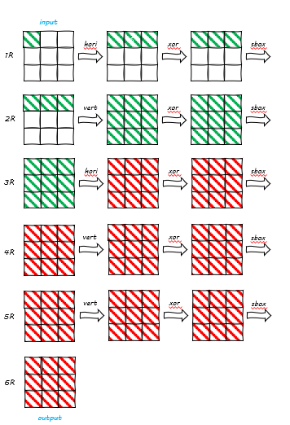

このようになり、解決可能になります。

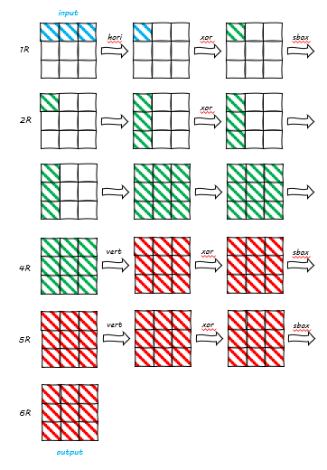

# やったね

最終的なスクリプトは以下のようになります。

```python
from Jenga import *
from ptrlib import *
import re
from itertools import product
import functools

def hori_inv_ret(b):
    for i in range(0, 9, 3):
        x, y, z = b[i:i+3]
        b[i:i+3] = (
            gf_mul(x, 0x9e) ^ gf_mul(y, 0x4f),
            gf_mul(y, 0x9e) ^ gf_mul(z, 0x4f),
            gf_mul(z, 0x9e) ^ gf_mul(x, 0x4f),
        )
    return b
def vert_inv_ret(b):
    for i in range(3):
        x, y, z = b[i], b[i + 3], b[i + 6]
        b[i], b[i + 3], b[i + 6] = (
            gf_mul(x, 0x9e) ^ gf_mul(y, 0x4f),
            gf_mul(y, 0x9e) ^ gf_mul(z, 0x4f),
            gf_mul(z, 0x9e) ^ gf_mul(x, 0x4f),
        )
    return b

def hori(b):
    for i in range(0, 9, 3):
        x, y, z = b[i:i+3]
        b[i:i+3] = (
            gf_mul(x, 4) ^ gf_mul(y, 2) ^ z,
            gf_mul(y, 4) ^ gf_mul(z, 2) ^ x,
            gf_mul(z, 4) ^ gf_mul(x, 2) ^ y,
        )
    return b
    
def sbox_inv(b):
    for i in range(9):
        b[i] = SBOX_inv[b[i]]
    return b

def recover_key(last_key):
    last_key = last_key[::-1]
    for i in range(36):
        last_key.append(SBOX_inv[last_key[i]]^last_key[i+1])
    return last_key[::-1][:9]

# prepare
pts = [bytes(hori_inv_ret(list(bytes([i])+b"\x00"*8))).hex() for i in range(256)]
regex = re.compile("[0-9a-f]{18}")
last_key = [[] for i in range(9)]

io = remote("nc jenga.chal.2024.ctf.acsc.asia 39425")
# io = process(["python3","task.py"])

io.sendline("\n".join(pts))
print("SENDED")
ret = regex.findall(io.recvuntil(b"pt? ").decode())
TEST = ret[0] 
AIM  = ret[-1]

known_part = [hori_inv_ret(sbox_inv(vert_inv_ret(list(bytes.fromhex(ct))))) for ct in ret[:-1]]
print("RECVED")


last_key = []
for index in range(9):
    ret = []
    for i in range(256):
        if functools.reduce(lambda x, y: x ^ y, [SBOX_inv[ct[index]^i] for ct in known_part])==0:
            ret.append(i)
    last_key.append(ret)
# recover_last key
for cand in product(*last_key):
    test_key = recover_key(hori(list(cand)))
    if Jenga(test_key).encrypt(b"\x00"*9).hex() == TEST:
        a = Jenga(test_key).decrypt(bytes.fromhex(AIM)).hex()
        print(a)
        io.sendline(a)
        io.sh()
        print("found")
        break

# ACSC{b40a78c51c581b7478e910df9ede1f50c036eb60a1fcd9b4146c5f92c6fdd348}
```

